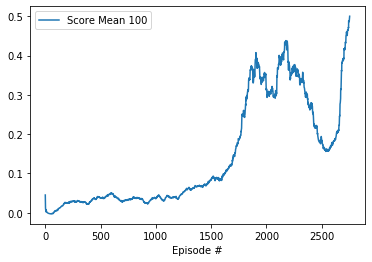

[//]: # (Image References)

[image1]: https://user-images.githubusercontent.com/10624937/42135623-e770e354-7d12-11e8-998d-29fc74429ca2.gif "Trained Agent"
[image2]: https://user-images.githubusercontent.com/10624937/42135622-e55fb586-7d12-11e8-8a54-3c31da15a90a.gif "Soccer"


# Project 3: Collaboration and Competition

### Introduction

For this project, you will work with the [Tennis](https://github.com/Unity-Technologies/ml-agents/blob/master/docs/Learning-Environment-Examples.md#tennis) environment.

![Trained Agent][image1]

In this environment, two agents control rackets to bounce a ball over a net. If an agent hits the ball over the net, it receives a reward of +0.1.  If an agent lets a ball hit the ground or hits the ball out of bounds, it receives a reward of -0.01.  Thus, the goal of each agent is to keep the ball in play.

The observation space consists of 8 variables corresponding to the position and velocity of the ball and racket. Each agent receives its own, local observation.  Two continuous actions are available, corresponding to movement toward (or away from) the net, and jumping. 

The task is episodic, and in order to solve the environment, your agents must get an average score of +0.5 (over 100 consecutive episodes, after taking the maximum over both agents). Specifically,

- After each episode, we add up the rewards that each agent received (without discounting), to get a score for each agent. This yields 2 (potentially different) scores. We then take the maximum of these 2 scores.
- This yields a single **score** for each episode.

The environment is considered solved, when the average (over 100 episodes) of those **scores** is at least +0.5.

### Multi-agent

Reinforcement learning (RL) has recently been applied to solve challenging problems, from game
playing to robotics. In industrial applications, RL is emerging as a practical component
in large scale systems such as data center cooling. Most of the successes of RL have been in
single agent domains, where modelling or predicting the behaviour of other actors in the environment
is largely unnecessary.

However, there are a number of important applications that involve interaction between multiple
agents, where emergent behavior and complexity arise from agents co-evolving together. For example,
multi-robot control, the discovery of communication and language, multiplayer games, 
and the analysis of social dilemmas  all operate in a multi-agent domain. Related problems,
such as variants of hierarchical reinforcement learning can also be seen as a multi-agent system,
with multiple levels of hierarchy being equivalent to multiple agents. Additionally, multi-agent
self-play has recently been shown to be a useful training paradigm. Successfully scaling RL
to environments with multiple agents is crucial to building artificially intelligent systems that can
productively interact with humans and each other.


### Installation

1. Download the environment from one of the links below.  You need only select the environment that matches your operating system:
    - Linux: [click here](https://s3-us-west-1.amazonaws.com/udacity-drlnd/P3/Tennis/Tennis_Linux.zip)
    - Mac OSX: [click here](https://s3-us-west-1.amazonaws.com/udacity-drlnd/P3/Tennis/Tennis.app.zip)
    - Windows (32-bit): [click here](https://s3-us-west-1.amazonaws.com/udacity-drlnd/P3/Tennis/Tennis_Windows_x86.zip)
    - Windows (64-bit): [click here](https://s3-us-west-1.amazonaws.com/udacity-drlnd/P3/Tennis/Tennis_Windows_x86_64.zip)
    
    (_For Windows users_) Check out [this link](https://support.microsoft.com/en-us/help/827218/how-to-determine-whether-a-computer-is-running-a-32-bit-version-or-64) if you need help with determining if your computer is running a 32-bit version or 64-bit version of the Windows operating system.

    (_For AWS_) If you'd like to train the agent on AWS (and have not [enabled a virtual screen](https://github.com/Unity-Technologies/ml-agents/blob/master/docs/Training-on-Amazon-Web-Service.md)), then please use [this link](https://s3-us-west-1.amazonaws.com/udacity-drlnd/P3/Tennis/Tennis_Linux_NoVis.zip) to obtain the "headless" version of the environment.  You will **not** be able to watch the agent without enabling a virtual screen, but you will be able to train the agent.  (_To watch the agent, you should follow the instructions to [enable a virtual screen](https://github.com/Unity-Technologies/ml-agents/blob/master/docs/Training-on-Amazon-Web-Service.md), and then download the environment for the **Linux** operating system above._)

2. Place the file under root folder of the repository, and unzip (or decompress) the file. 

3. Install [Anaconda](https://www.anaconda.com/)

4. Run code in anaconda prompt to setup python environment
```
conda env create -f environment.yaml
```
### Run the exercise

- Activate ml-agents environment with code
```
activate ml-agents
```
- There're several instructions notebook under `/report`. 
- Open `Report.ipynb` or `Report.html` to read details for design and implementations of this project.
- Open `Tennis-MADDPG.ipynb` to review the maddpg agents training process.
- Open `Tennis-MADDPG-PER.ipynb` to review the maddpg agents with PER(prioritized experience replay) training process.
- Open `maddpg.py` to review codes of maddpg implementation.
- Open `maddpg_v3.py` to review codes of maddpg with PER implementation.
- Open `Unity Environment 10_18_2019 1_44_00 AM.mp4` to watch smart agents play.
To open these instructions, get to repository folder and type in anaconda prompt:
```
jupyter notebook
```


### Solution Pseudo code


### Hyperparameters:

```python
BUFFER_SIZE = int(1e6)  # replay buffer size
BATCH_SIZE = 512        # minibatch size
LR_ACTOR = 1e-3         # learning rate of the actor
LR_CRITIC = 1e-3        # learning rate of the critic
WEIGHT_DECAY = 0        # L2 weight decay
LEARN_EVERY = 1         # learning timestep interval
LEARN_NUM = 5           # number of learning passes
GAMMA = 0.99            # discount factor
TAU = 8e-3              # for soft update of target parameters
OU_SIGMA = 0.2          # Ornstein-Uhlenbeck noise parameter, volatility
OU_THETA = 0.15         # Ornstein-Uhlenbeck noise parameter, speed of mean reversion
EPS_START = 5.0         # initial value for epsilon in noise decay process in Agent.act()
EPS_DECAY = 6e-4        # episode to end the noise decay process
EPS_FINAL = 0           # final value for epsilon after decay
```

### Result
